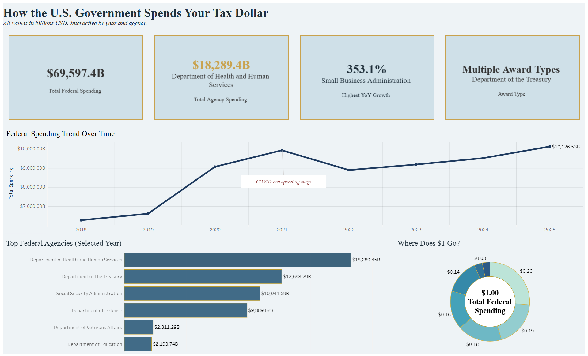
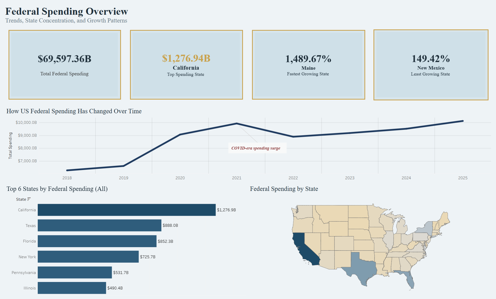

# Tensor Terps — US Government Spending Explorer

## Project Summary
This project promotes financial literacy by transforming complex U.S. government spending data into clear, interactive visualizations.

## Data Source
- USAspending.gov API

## Repository Structure
- sql/ — database schema and analytics views
- python/ — ETL scripts
- data/processed/ — curated datasets for Tableau
- tableau/ — Tableau dashboards and screenshots

## How to Reproduce
1. Run SQL scripts in order (01 → 03)
2. Load processed CSVs
3. Open Tableau workbook

## Dashboards
The project includes an interactive Tableau dashboard published on Tableau Public, along with static previews below.

**Live Dashboard 1:** 
https://public.tableau.com/views/HowUSStatesSpends/Dashboard2?:language=en-GB&:sid=&:redirect=auth&:display_count=n&:origin=viz_share_link

**Live Dashboard 1:** https://public.tableau.com/views/HowUSAgenciesSpend/How_US_Government_Spends?:language=en-GB&:sid=&:redirect=auth&:display_count=n&:origin=viz_share_link 

### Dashboard Highlights
- Total U.S. government spending trends over time
- Top federal agencies by annual spending
- Year-over-year (YoY) growth analysis
- Award type distribution (Contracts vs Assistance)
- State-level spending patterns

### Screenshots

#### Agency Spending Analysis

#### State-Level Spending Map

## Tools & Technologies
SQL Server, Python, Tableau, USAspending.gov API

## Team
Tensor Terps — University of Maryland
